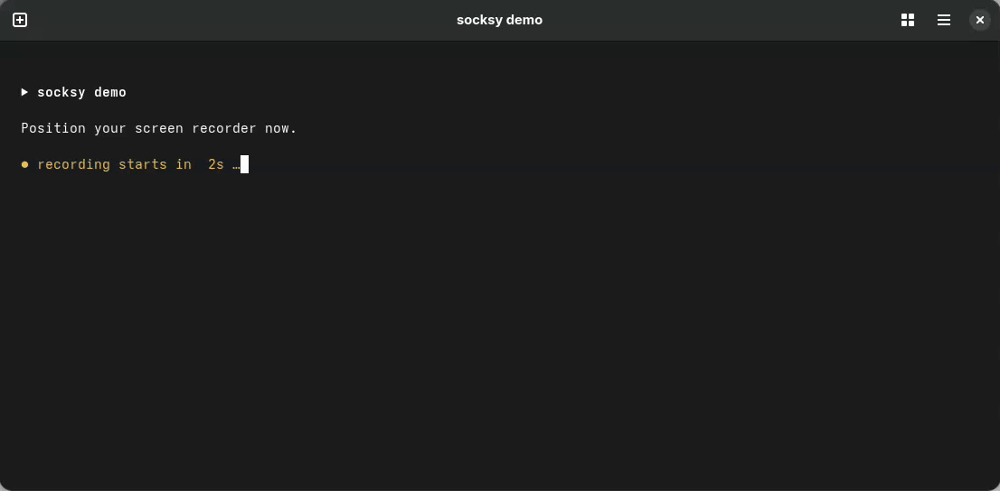

# socksy

[](https://github.com/Nrentzilas/socksy/actions/workflows/tests.yml)
[](https://github.com/Nrentzilas/socksy/actions/workflows/shellcheck.yml)
[](LICENSE)

**The easy way to run an authenticated SOCKS5 proxy system-wide on Linux desktops.**

Paste one proxy string. socksy handles the credentials, wires up your desktop
proxy, and confirms your new exit IP, all in a single command. Works on GNOME
and KDE, with a CLI-only fallback for everything else.



```bash
socksy set 'user:pass@host:port'
```

```
▸ upstream : user:***@eu.example.net:1080
▸ relay    : 127.0.0.1:1081
✔ proxy applied.
✔ exit IP: 41.45.55.53
```

---

## Why this exists

Desktop proxy settings **cannot send a SOCKS username and password**; there are
simply no fields for it. So if your provider gives you an *authenticated* SOCKS5
proxy (very common for residential/mobile proxies), the system proxy GUI is a
dead end: apps connect, then get rejected.

socksy solves this the clean way:

```
  your apps  ──▶ 127.0.0.1:1081 ──▶ gost relay ──▶ your.proxy:1080
   (no auth)      (local, no auth)   (adds creds)   (authenticated)
```

A tiny local relay ([gost](https://github.com/go-gost/gost)) holds your
credentials and forwards traffic upstream. Your desktop just points at the local
relay. You get system-wide, authenticated SOCKS5 with zero fuss.

## Features

- **One command** to apply, one to turn off. No config files to hand-edit.
- **Handles authentication** that the desktop proxy GUI can't do on its own.
- **GNOME, KDE, or CLI-only**: autodetects the right backend, override with `SOCKSY_BACKEND`.
- **Auto-installs** the `gost` relay on first use, with **SHA-256 verification** (no root needed).
- **Runs as a systemd user service**: survives logout, restarts on failure.
- **Saved profiles**: `socksy save work '...'` then `socksy use work`.
- **Sticky sessions**: `--sticky` / `--session <id>` to hold one exit IP.
- **Country builder**: `--country GR` tags the username for a geo-targeted exit.
- **SOCKS5 / HTTP / HTTPS upstreams**: `--type http` for proxies that aren't SOCKS.
- **Remote DNS**: `socksy dns on` stops Firefox DNS leaks.
- **LAN bypass**: `socksy bypass` manages the no-proxy list (localhost, `.local`, RFC1918).
- **Health watchdog**: `socksy watchdog on` auto-restarts the relay when the exit goes bad.
- **Live IP watch**: `socksy watch` loops the exit IP and flags every change.
- **Scriptable**: `socksy status --json` for status bars and automation.
- **Optional config file**: set your own defaults in `~/.config/socksy/config`.
- **Shell completions**: bash & zsh, including profile names.
- **Instant feedback**: every apply prints your real exit IP.
- **Clean off switch**: `socksy off` returns you to a direct connection.
- **No root. No system packages.** Everything lives under `~/.local` and `~/.config`.

## Requirements

- A Linux desktop. socksy autodetects a backend:
  - **GNOME** and relatives (Cinnamon, MATE, Budgie, Unity, Pantheon), via `gsettings`.
  - **KDE Plasma**, via `kwriteconfig` writing `~/.config/kioslaverc`.
  - Anything else, including **headless/CLI-only**, via a sourceable `~/.config/socksy/env.sh`.

  > The KDE backend has not yet been exercised on a real Plasma session. If you run
  > KDE, reports either way are welcome in the issue tracker.

- `systemd` user services (standard on modern Linux).
- `curl` (to auto-download gost) and `bash`.

## Install

```bash
git clone https://github.com/Nrentzilas/socksy.git
cd socksy
./install.sh
```

That copies `socksy` into `~/.local/bin` and ensures it's on your `PATH`.
Restart your shell (or `source ~/.bashrc`) if the command isn't found yet.

To install somewhere else, pass `--prefix`:

```bash
./install.sh --prefix /usr/local     # system-wide (needs write access)
./install.sh --no-path               # never touch ~/.bashrc or ~/.zshrc
```

Uninstalling mirrors it: `./uninstall.sh [--prefix DIR] [--purge]`.

### The relay binary

socksy needs [gost](https://github.com/go-gost/gost) for the local relay. If a
`gost` is already on your `PATH`, socksy uses it. Otherwise it downloads a
checksum-verified copy to `~/.local/bin/gost` on first use, no root required.
Set `SOCKSY_GOST=/path/to/gost` or the `gost_path` config key to pin a specific
binary.

## Usage

```bash
socksy set 'user:pass@host:port'    # apply a proxy now (auto-tests the exit IP)
socksy set --type http 'user:pass@host:port'   # HTTP/HTTPS upstream (default: socks5)
socksy set --country GR 'user:pass@host:port'  # tag the username for a GR exit
socksy on                           # re-apply the last proxy
socksy off                          # back to a direct connection
socksy status                       # what's active right now
socksy status --json                # machine-readable status (for scripts)
socksy test                         # print the current exit IP
socksy watch [seconds]              # live exit-IP loop (default 5s; flags changes)
socksy watchdog on|off|status       # auto-restart the relay when the exit goes bad

socksy dns on|off|reset|status      # remote DNS for Firefox (see below)
                                    # reset removes socksy's block from user.js
socksy bypass list|add|rm|reset     # manage the no-proxy (ignore-hosts) list

socksy save <name> 'user:pass@..'   # remember a proxy under a name
socksy use  [<name>]                # apply a saved proxy (no name = last used)
socksy list                         # list saved proxies (passwords masked)
socksy rm   <name>                  # forget a saved proxy
```

No-auth proxies work too; just pass `host:port`.

### Config file (optional)

Set your own defaults in `~/.config/socksy/config` (simple `key = value` lines,
parsed, never executed). Recognised keys:

```ini
local_port      = 1081
gost_version    = v3.2.6
gost_path       = /usr/bin/gost   # use an existing gost instead of downloading one
type            = socks5          # default upstream type: socks5 | http | https
session_keyword = -session-       # your provider's sticky-session keyword
country_keyword = -country-       # your provider's country keyword
ignore_hosts    = localhost,127.0.0.0/8,::1,*.local,10.0.0.0/8,172.16.0.0/12,192.168.0.0/16
health_interval = 30              # watchdog: probe the exit every N seconds
health_fails    = 2               # restart the relay after N consecutive failures
health_url      = https://api.ipify.org
backend         = gnome           # desktop proxy backend: gnome | kde | env (default: autodetect)
```

Precedence is **environment variable → config file → built-in default**, so an
env var like `SOCKSY_LOCAL_PORT` still wins for one-off overrides.

### Health watchdog

Rotating residential proxies occasionally hand you a dead exit node. Turn on the
watchdog and socksy will notice and reconnect for you:

```bash
socksy watchdog on       # probe the exit every 30s; restart the relay after 2 fails
socksy watchdog status   # is it on, and what did the last check see?
socksy watchdog off
```

It runs as a systemd user timer, so it keeps working after logout. When the
proxy is off (`socksy off`) the watchdog automatically stands down and resumes
once you turn a proxy back on. Tune the cadence with `health_interval` /
`health_fails` in the config file.

### Sticky sessions (keep the same IP)

Rotating proxies hand you a new exit IP on every connection. To pin one:

```bash
socksy set --sticky 'user-country-GR:secret@host:1080'      # random session tag
socksy set --session home1 'user-country-GR:secret@host:1080'  # reuse a fixed tag
```

socksy appends a session tag to your username (default keyword `-session-`).
**Your provider must recognise that keyword.** Check their docs and, if it
differs, override it:

```bash
export SOCKSY_SESSION_KEYWORD='-sessid-'
```

### Browsers & DNS

Point Firefox/Chrome at **"Use system proxy settings"** to follow socksy on
GNOME or KDE. With the `env` backend there is no system proxy, so start browsers
from a shell that has sourced `~/.config/socksy/env.sh`.

DNS posture with the relay:

| Client | DNS resolution | Leak? |
|---|---|---|
| CLI via `socks5h://` | at the exit (remote) | no |
| System-proxy apps (GNOME/KDE) | hostname passed to SOCKS | no |
| Chrome + SOCKS5 | remote by default | no |
| **Firefox** | **local, unless configured** | **yes** |

So `socksy dns on` flips Firefox's `network.proxy.socks_remote_dns` in every
profile (restart Firefox to apply); `socksy dns off` reverts it. Everything else
already resolves at the exit.

## How it's wired

| Piece | Location |
|---|---|
| `socksy` command | `~/.local/bin/socksy` |
| `gost` relay binary | `~/.local/bin/gost` |
| systemd user service | `~/.config/systemd/user/socksy-relay.service` |
| watchdog timer (opt-in) | `~/.config/systemd/user/socksy-watchdog.{service,timer}` |
| saved profiles | `~/.config/socksy/profiles` (chmod `600`) |
| optional config | `~/.config/socksy/config` |
| env-backend exports | `~/.config/socksy/env.sh` (chmod `600`, `env` backend only) |
| local relay listener | `127.0.0.1:1081` |

## Security notes

- Proxy credentials are stored **in plain text** in the systemd unit and the
  profiles file, both written with `600` permissions (only your user can read
  them). This is standard for local proxy setups, but don't commit these files
  or share them.
- socksy never sends your credentials anywhere except to the upstream proxy you
  specify.

## Uninstall

```bash
./uninstall.sh            # removes socksy + service, keeps gost & profiles
./uninstall.sh --purge    # also removes gost and saved profiles
```

## Roadmap

Done recently:

- [x] KDE and non-GNOME backends (autodetected; `env`-file fallback for CLI-only)

Still ahead:

- [ ] GUI / tray applet
- [ ] Packaging: `.rpm` / `.deb`

Contributions welcome; see [CONTRIBUTING.md](CONTRIBUTING.md).

## License

[MIT](LICENSE)
